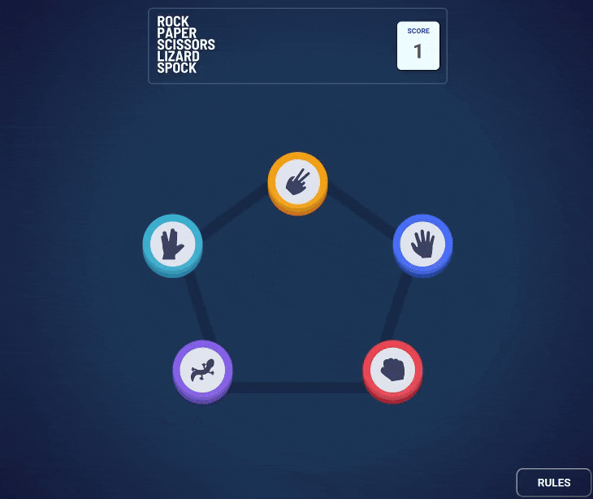

# Rock, Paper, Scissors, Lizard, Spock

A modernized, interactive version of the classic game rock paper scissors but with added variation of lizard and spock. This project features complex win-state logic, smooth DOM animations, and a fully responsive mobile-first layout.

## 🔗 Links

- **Live Demo Link:**

## ⚔️ RPSLS Showcase

_The game features fluid state transitions, fading from selection to the "House" reveal._

## 🧐 About The Project

While the original game has only 3 possible outcomes, adding "Lizard" and "Spock" expands the complexity to 5 variables and 25 possible matchup combinations.

The goal of this project was to handle this complexity cleanly. Instead of cluttering the code with dozens of conditional statements, I focused on scalability and state management. The UI was built **Mobile-First**, ensuring that the circular game board scales perfectly from a smartphone screen up to a desktop monitor.

### Key Features

- **Complex Game Logic:**
  - Implemented a `Map` based data structure to determine winners efficiently.
  - Solves the "who beats who" logic in O(1) time complexity rather than nested if/else chains.
- **Cinematic State Transitions:**
  - **Phase 1:** User Selection (Fade Out).
  - **Phase 2:** The "Face Off" (Fade In + Tension Delay).
  - **Phase 3:** The Reveal (House picks a hand + Winner declared).
- **Responsive Architecture:**
  - Uses relative units (`rem`, `%`) and media queries to resize the pentagon grid layout dynamically.
  - The UI adjusts touch targets for mobile users while maintaining a clean aesthetic on desktop.
- **Rules Modal:** An overlay accessible at any time to remind players of the win conditions (e.g., "Lizard poisons Spock").
